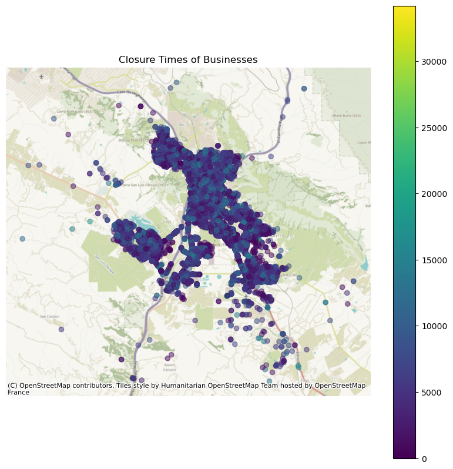
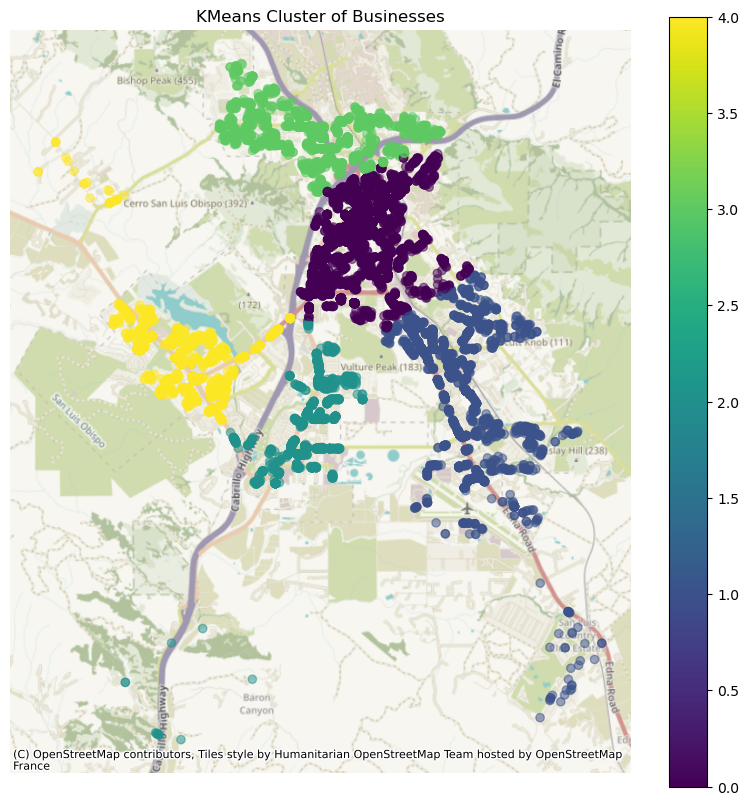

# Survival Data of Business Licenses in the City of San Luis Obispo

Raw unprocessed data can be found in `raw_data.xlsx`

`BLSurvival.txt` has been preprocessed and cleaned.

The following preprocessing has been made.

+ Only businesses that are physically in the City of SLO.
+ They have a start date.
+ Data has been merged with geocodings to get lot size.
+ Only businesses that have existed since 2003. (Closed after 2003 or is still open).

Below is a plot of all of the business locations for all observed businesses.

## Variable Descriptions
+ `closure_time` -  The time since opening of the store until closure (or now if the store is still open).
+ `censor` -  Censor variable. `1` indicates the store has closed. `0` indicates the store is still open.
+ `500m_5yr_churn` - The 5 year churn rate of businesses within 500m at the time of opening.
    + Calculated as number of businesses that have existed between the time of business start and 5 years before within 500m divided by the number of those that have closed. 0 means no businesses within 500m have closed in the past year. 1 means every business that has existed in 500m has closed in the past 5 years.

+ `Business type` - This is the category of business.
+ `Rate type (STD)` - Different businesses have to pay different rates of business tax every year (depending on gross income).
Businesses with the same `Rate type` pay the same taxes.
+ `cluster` (categorical) - broad location of the business. (see below)

+ `ft to downtown` - How far away is the business from downtown slo (the downtown area zone).
+ `is_downtown_assocation` - Downtown Assocation imposes a $150 tax to all businesses operating in the downtown zone. `1` indicates the business is in the boundaries.
+ `is_home_occ` - Is the business being run from a home. (A home occupation)
+ `sq(ft)` - How big the parcel is in square feet.
+ `start_year` - The year in which the business opened.
+ `type` - A clustered form of `Business type`
+ `zone` - The zone associated with the parcel where the store is located.
+  `zone_type` - Clustered form of `zone`.
+ `businesses_within_500m` - Number of businesses that were open within 500m at the time of business license start.

